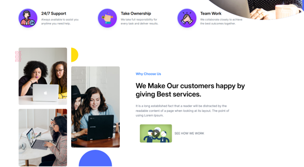
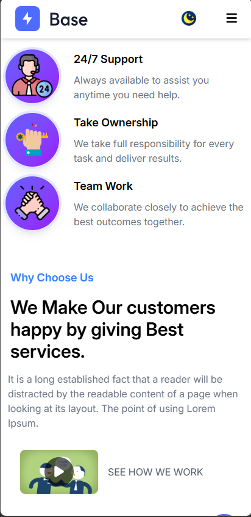

# 🚀 Base Startup Landing Page

A modern, high-performance landing page built with Tailwind CSS, showcasing clean UI implementation and responsive design practices.

<b>Light mode Version</b><br>
<div align="center">
  
</div>

<b>Dark mode Version</b> <br>
<div align="center">

</div>


<p align="center">🌐 Live Demo: https://tailwind-startup-template.vercel.app/</p>

---

## 📸 Preview

<b>🖥️ Hero Desktop Version</b> <br>
<div align="center">

</div>

<b>📱Hero Moblie Version</b> <br>
<div align="center">
   
</div>

<b>🖥️Features & About us Desktop Version</b> <br>
<div align="center">

</div>

<b>📱Features & About us Mobile Version</b> <br>
<div align="center">
   
</div>


## ⚙️ Tech Stack

* HTML5 – Semantic, accessible structure

* Tailwind CSS – Utility-first styling

* Vanilla JavaScript – Lightweight interactions

* External Libraries – AOS scroll animation, slick carousel and CountUp.js

## 🗝️ Key Features

* Responsive Design – Works across mobile, tablet, and desktop

* Modern UI Sections – Hero, Pricing, Testimonials, Contact

* Optimized Performance – Tailwind JIT for minimal CSS bundle

* Flexible Layouts – Built with Flexbox & CSS Grid
  
## 🛠️ Quick Start

```bash
git clone https://github.com/DucNguyen1402-dev/tailwind-startup-template.git

cd tailwind-startup-template

npm install

npm run dev
```

## 📌 Notes

* Designed as a base template for startup landing pages

* Easy to customize and extend for real-world projects


## 👨‍💻author

**Duc Nguyen**

* [](https://github.com/DucNguyen1402-dev)

* [](hoangduc140220@gmail.com)

*Learning web development by creating small, interactive projects.*